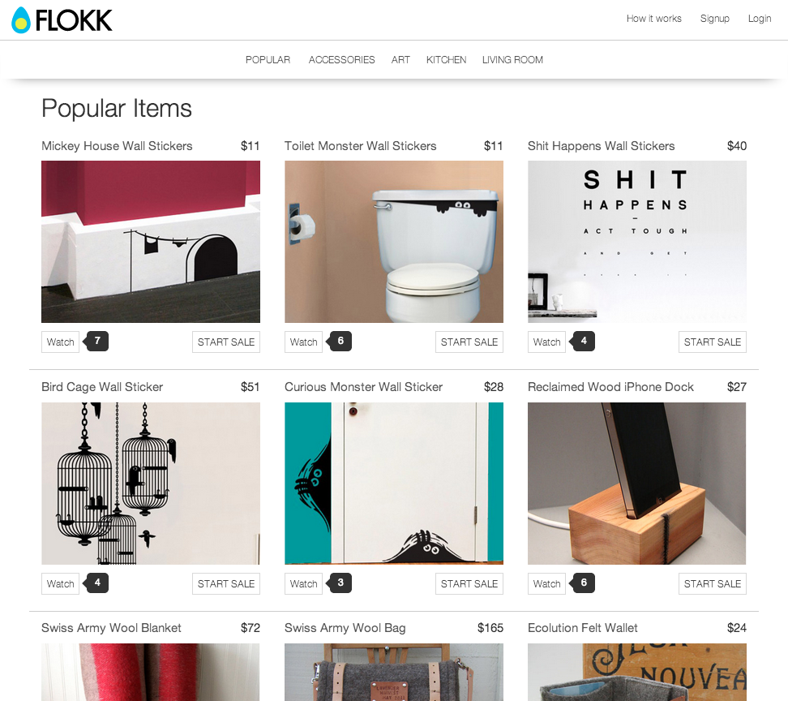
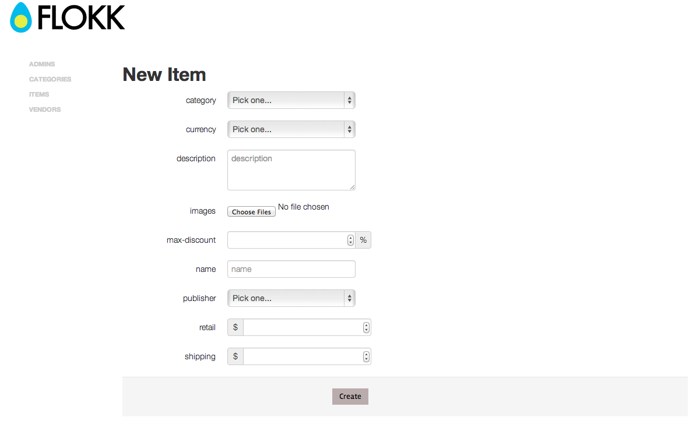
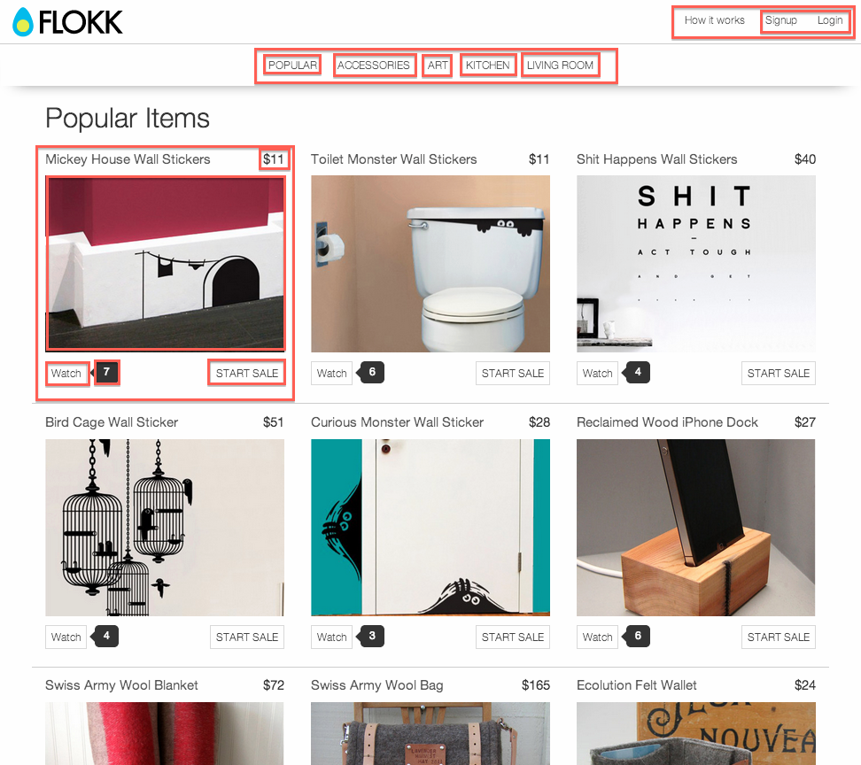
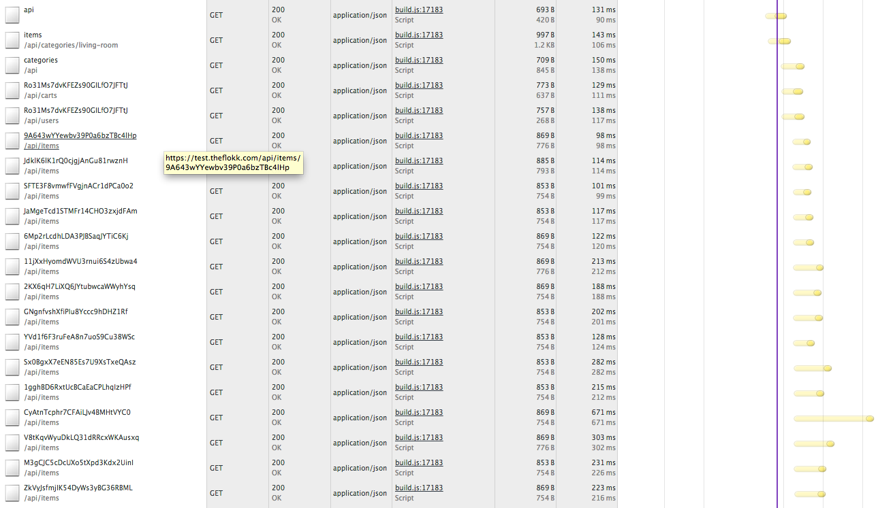
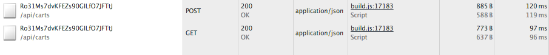

!SLIDE

# The Art of Trade-offs

!SLIDE

# The Art of Trade-offs

###### Email: cameron@theflokk.com
###### GitHub: @CamShaft
###### Twitter: @CameronBytheway

!SLIDE

# We are all artists

!SLIDE

# What is art?

From wikipedia:

> General descriptions mention an idea of human agency and creation through imaginative or technical skill.

!SLIDE

Decisions made while transforming this:

!SLIDE

Into this:

!SLIDE

# Media type

!SLIDE

# Many json flavors

* [collection+json](http://amundsen.com/media-types/collection/)
* [hal+json](http://stateless.co/hal_specification.html)
* [siren+json](https://github.com/kevinswiber/siren)
* [hyper+json](https://github.com/timshadel/hyper)

!SLIDE

# So which one is the best?

!SLIDE

# The answer is yes.

!SLIDE

# H-Factors can help

!SLIDE

# Agnostic vs Domain-aware

!SLIDE

!SLIDE

[collection-json-explorer](http://collection-json-explorer.herokuapp.com/render?url=http%3A%2F%2Femployee.herokuapp.com%2Femployee#template)

!SLIDE

!SLIDE

!SLIDE

# Small vs large resources

!SLIDE

Do you have a low-latency network?

!SLIDE

Do your resources naturally cache?

!SLIDE

Do your resources naturally invalidate their cache?

!SLIDE

# Show/hide affordances based on user

!SLIDE

# Unauthenticated

!SLIDE

# Authenticated

!SLIDE

# Other trade-offs

* Languages
* Databases
* Platforms
* Authentication methods
* MV* client frameworks

!SLIDE

# Real-time

!SLIDE

We use [Pusher](http://pusher.com) for updates to resources

!SLIDE

# Steps

1. Client makes a request to resource owner
2. Client subscribes to resource using the URL as the key
3. Resource owner POSTs notifications to pusher
4. Pusher notifies each client interested in the resource
5. The client re-requests the resource, ignoring any cached values

!SLIDE

[Demo](https://www.theflokk.com)

!SLIDE

# Questions?

###### Email: cameron@theflokk.com
###### GitHub: @CamShaft
###### Twitter: @CameronBytheway
